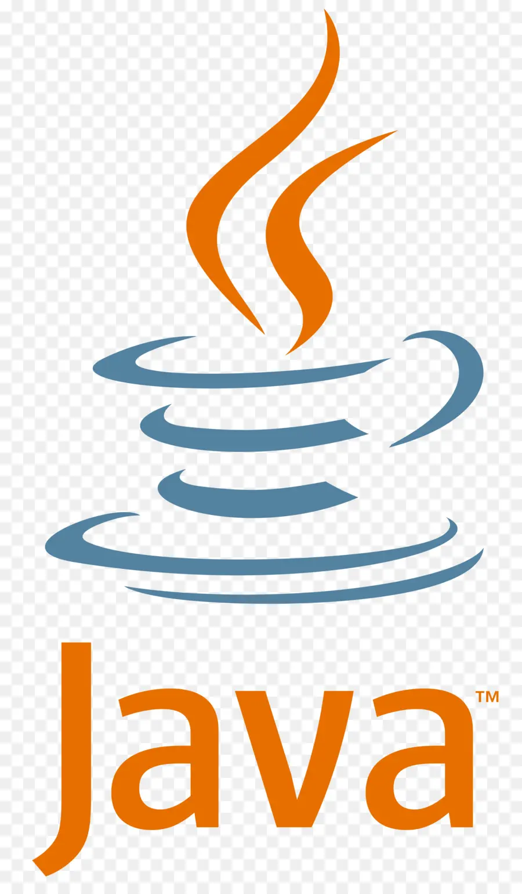

&nbsp;&nbsp;
&nbsp;&nbsp;

<h1 align="center">👋&nbsp; About Me!</h1>

My name is Brandon Mizutani, and I am a dedicated software developer based in Seattle, WA, with a strong background in advanced software development. I hold a Certificate in Advanced Software Development in Python from Code Fellows and a Bachelor of Arts in Asian Pacific Studies from Loyola Marymount University. My expertise spans multiple languages and frameworks, including Python, JavaScript, React, and Django. I have worked on notable projects such as developing an e-commerce storefront using React and Redux, a Django-based To-Do App with a focus on secure login and task storage, and an e-commerce app named Insta Dealz. In my professional journey, I have significantly contributed as a Lead TA and Tutor at Code Fellows, where I assisted students with programming concepts and enhanced their technical proficiency.Passionate about coding, I continually apply my knowledge to develop innovative and efficient applications. I am committed to creating successful computer and mobile applications that meet the needs of users and drive technological advancement.

  

## 🐍 &nbsp; Languages

|  |  |  |  |  |
| ----------- | ----------- | ----------- | ----------- | ----------- | 
|  |  |  |  |  |

<h1 align="center">⚡&nbsp; Projects</h1>

- <b> Mad Librarians</b>
  - Project created to showcase knowledge of functions, DOM manipulation
  - [Repo](https://github.com/ponceedi000/mad-librarians)

- <b>Project Celestiality</b>
  - An app that provides users with historical facts, astrological sign, their horoscope, and a journal entry form that can saved, deleted, and updated.
  - [Repo](https://github.com/CABB-Group)
  - [Netlify](https://project-celestiality.netlify.app)

- <b>Insta Dealz </b>
  - An e-commerce app that allows the user to buy items, view product details, deleted items in their cart, and view the cart total amount.
  - [Repo](https://github.com/Team-PythonGo/insta_dealz_fe)
  - [Vercel](https://insta-dealz-2ir84llib-insta-deals.vercel.app/)
 
- <b> Todo App </b>
  - To-Do App is a task management application that allows users to efficiently manage their daily tasks. The app features bearer authentication via the server, ensuring secure user authentication and authorization. Depending on the user's role and capabilities, they can access the to-do list and settings, add new tasks, delete tasks, and mark tasks as completed. This robust functionality provides users with the tools they need to stay organized and manage their tasks effectively.
  - [Repo](https://github.com/bran2miz/todo-app)
  - [Render](https://auth-api-v2.onrender.com/)
 
- <b> StoreFront </b>
  - Storefront App is a dynamic e-commerce application that allows users to explore and purchase items across multiple categories. Users can browse products, add them to their cart, and proceed to checkout. The app features a responsive user interface, with options for users to filter products by category, view detailed product information, and manage their shopping carts efficiently. Storefront also includes features like inventory management and real-time updates to ensure a smooth shopping experience.
  - [Repo](https://github.com/bran2miz/storefront)
  - [Render](https://auth-api-v2.onrender.com/api/v1)

- <b> RESTyrant </b>
  - Restyrant App is a web application designed to manage restaurant operations and customer interactions. The backend was developed using Django Rest Framework and deployed to AWS EC2, with the frontend hosted separately. The two components were integrated by configuring environment variables through a .env file, and permissions were carefully managed to ensure secure communication between the frontend and backend. This setup provides a robust and scalable solution for restaurant management needs.
  - [Repo](https://github.com/bran2miz/restyrant)
  - [Render](https://django-x-restuarant-app.onrender.com/)
    
- [Python Data Structures and Algorithms](https://github.com/bran2miz/data-structures-and-algorithms)

<h1 align="center">🔧 Tools</h1>

 

| | | |
| ----------- | ----------- | ----------- |
|  Mongo |  Express.js |  React |
|  Node |  Next |  Django |
|  TailwindCSS |   Docker |  PostgreSQL |
| AWS |  Netlify |  Heroku |
| Git | Github | Linux |
|  Bulma | Bootstrap |  Canva |
|  Jest |  Socket.io |  Material UI |
|  Render |  Redux |  Vite/REACT|
|  Auth0 |  Sequelize |  React Native|

## Hobbies / Interests

    🛩️ Traveling
    🍽️ Restaurants
    👜 Fashion
    🪴 House Plants

<h1 align="center"> Connect with me !</h1>

  &nbsp;  &nbsp;&nbsp; [Linkedin](https://www.linkedin.com/in/brandon-mizutani)

  &nbsp;  &nbsp;&nbsp; [Email me](mailto:bran2miz@gmail.com)

  &nbsp;  &nbsp;&nbsp;
  [Book a tutoring session with me](https://calendly.com/bran2miz/60min)

<h2  align="center">📚 Resources Used to Build This Repo:</h2>

- Header from Canva

- Social media favicons from Icons8

- README Statistics from anuraghazra

- Emojis from webfx.com
