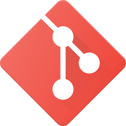

&nbsp;&nbsp;
&nbsp;&nbsp;

<h1 align="center">👋&nbsp; About Me!</h1>

I am a software developer, LMU grad, former television production assistant, and dedicated individual who has high aspirations to break into the tech industry. I am in pursuit for a career in tech that allows me to work with like-minded individuals who have the same passion for coding!

  
  
## 📊 My Statistics
  

  

## 🐍 &nbsp; Languages

|  |  |  |  |
| ----------- | ----------- | ----------- | ----------- |
 |  |  |  |
|  |  |  |  |

<h1 align="center">⚡&nbsp; Projects</h1>

- <b> Mad Librarians</b>
  - Project created to showcase knowledge of functions, DOM manipulation
  - [Repo](https://github.com/ponceedi000/mad-librarians)

- <b>Project Celestiality</b>
  - An app that provides users with historical facts, astrological sign, their horoscope, and a journal entry form that can saved, deleted, and updated.
  - [Repo](https://github.com/CABB-Group)
  - [Netlify](https://project-celestiality.netlify.app)

- <b>Insta Dealz </b>
  - An e-commerce app that allows the user to buy items, view product details, deleted items in their cart, and view the cart total amount.
  - [Repo](https://github.com/Team-PythonGo/insta_dealz_fe)
  - [Vercel](https://insta-dealz-2ir84llib-insta-deals.vercel.app/)

- [Python Data Structures and Algorithms](https://github.com/bran2miz/data-structures-and-algorithms)

<h1 align="center">🔧 Tools</h1>

| | | |
| ----------- | ----------- | ----------- |
|  Mongo |  Express.js |  React |
|  Node |  Next |  Django
|  TailwindCSS |   Docker |  PostgreSQL
| AWS |  Netlify |  Heroku
| Git | Github | Linux
|  Bulma | Bootstrap |  Canva |

## Hobbies / Interests

     Traveling
     Restaurants
     Fashion
     House Plants

## Connect with me

  &nbsp;  &nbsp;&nbsp; [Linkedin](https://www.linkedin.com/in/brandon-mizutani)

  &nbsp;  &nbsp;&nbsp; bran2miz@gmail.com
